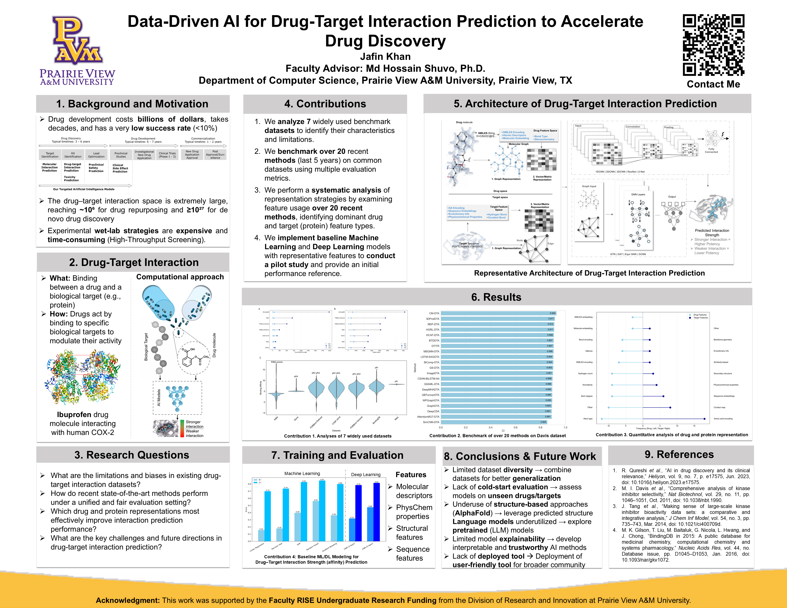

# Drug-Target Interaction Prediction

## Overview

This repository documents my undergraduate research on machine learning approaches for drug-target interaction prediction. The research was conducted under the supervision of Dr. Md Hossain Shuvo at Prairie View A&M University.

The project examined computational methods that can help identify potential interactions between drugs and biological targets during early-stage drug discovery.

## Research Motivation

Drug discovery is expensive and time-consuming. Computational drug-target interaction prediction can help researchers prioritize promising drug-target pairs before conducting costly laboratory experiments.

## My Contributions

My work focused on:

- Analyzing widely used drug-target interaction benchmark datasets
- Reviewing recent machine learning and deep learning methods
- Studying drug and protein feature representations
- Comparing model evaluation strategies
- Investigating baseline machine learning approaches
- Summarizing research limitations and future directions
- Presenting the work at Prairie View A&M University Student Research Week

## Research Questions

- What limitations and biases exist in current drug-target interaction datasets?
- How do recent machine learning and deep learning methods perform under consistent evaluation settings?
- Which drug and protein representations are most useful for interaction prediction?
- What challenges affect model generalization to unseen drugs and targets?
- How can high-performance computing support larger experiments?

## Datasets Studied

The project examined widely used benchmark datasets, including:

- DAVIS
- KIBA
- BindingDB
- PDBbind

The analysis considered dataset size, drug and protein representation, interaction labels, and potential limitations.

## Methods Reviewed

### Machine Learning

- Logistic Regression
- Naive Bayes
- Decision Tree
- Support Vector Machine
- Multi-Layer Perceptron

### Deep Learning

- Convolutional Neural Networks
- Graph Neural Networks
- Transformer-based models

## Drug Representations

- Molecular descriptors
- Physicochemical properties
- Molecular fingerprints
- Graph-based representations

## Protein Representations

- Protein sequence length
- Amino acid composition
- Sequence-based features
- Structural representations

## Evaluation Metrics

- Accuracy
- Precision
- Recall
- F1 Score
- ROC-AUC
- Confusion Matrix

## Research Poster

The research poster is available in the [`docs`](docs) directory.

## Tools and Technologies Studied

- Python
- Pandas
- NumPy
- Scikit-learn
- RDKit
- Matplotlib
- Linux
- High-performance computing environments

## Key Findings

The literature analysis showed that model performance is strongly affected by:

- Dataset diversity
- Data splitting strategy
- Drug and protein representations
- Class imbalance
- Model generalization to unseen drugs and targets
- Differences in evaluation procedures

## Limitations

This repository primarily documents the research review, dataset analysis, methodology planning, and poster presentation. It does not currently include a complete software implementation of the reviewed models.

## Future Work

- Implement reproducible baseline models
- Evaluate cold-drug and cold-target splits
- Explore graph neural networks
- Study Transformer-based protein representations
- Add explainable AI methods
- Parallelize preprocessing and feature extraction
- Run large experiments using HPC resources
- Explore distributed and GPU-based training

## Presentation

This work was presented at Prairie View A&M University Student Research Week.

## Author

**Jafin Khan**  
Bachelor of Science in Computer Science  
Prairie View A&M University
